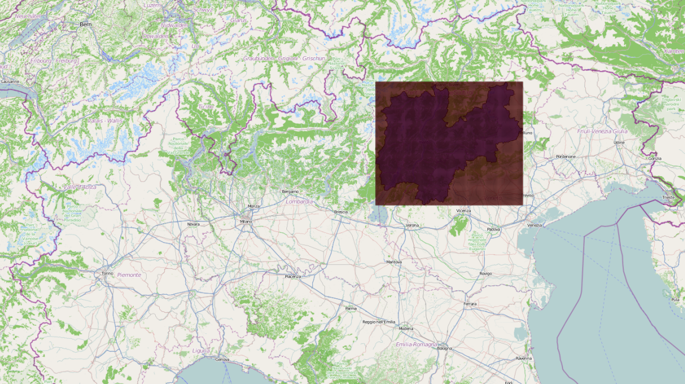

[Introduction](./index.html) | [Milano Data Analysis](./pages/milano.html) | [Trento Data Analysis](./pages/trento.html) | [Weather Correlation](./pages/correlation.html)

At the beginning of 2014, Telecom Italia launched the first edition of the Big Data Challenge, a contest designed to stimulate the creation and development of innovative technological ideas in the Big Data field. For the analysis purpose, I used the data of two provinces Milano and Trento to analyse telecommunication activities, usage pattern, usage during the day and night. For the very provinces, i analysed the weather data and tried to find out the correlation between different weather conditions (clear, rainy, snow) and communication pattern. Since, the volume of data was huge, so a good was to apply the analysis methods was to use GraphLab as the purpose of this study was to learn parallel computation with big data. 

### Data Description

In this study i used three general kinds of datasets - Milano Dataset, Trento Dataset and Weather Dataset. Weather data tells us the precipitation of every hours. Originally the data recorded was for every 10 minutes interval for all the given datasets. The Milano and Trento datasets include SMS in and out, calls in and out, and internet activity for the month of November and December 2013.The data was recorded with a 10 minute intervals for all the given features. The volume of this dataset was huge, approximately 46 gigabytes.

### Analysis Tasks:

The focus of this study was first wrangling the data and then finding out answers of the following queries:
1. Find out the most called province by the people of Milano and Trento.
2. Find out the congested communication hours in Milano and Trento.
3. Find out the most tweeted languages in Milano for the given dates.
4. Compare telecommunication usage of November and December 2013.
5. Analyse and find out the pattern of telecommunication activities during the day time and night.
6. Analyse the data and find out correlation between telecommunication activities for different weather conditions (Clear, Rain, Snow). 

#### Provinces Data for Milano & Trento

The data contains the timestamp, calls in and out, province names where the call is outgoing, and the location grid. The datasets referring to the Trentino territory are spatially aggregated using a grid. The grid consists of a cellid abd the cell geometry, which is  expressed as geoJSON. The portion of territory covered by the grid is shown in the following picture where the grid (red-gray) is overlaid to the northern part of Italy. The Trentino province is highlighted in violet.

#### Weather data

Weather data has five attributes/features temperature (T), pressure (P), humidity (U), wind speed (Ff) and dew point (Td). Notable from the weather statistics, the temperature is positively skewed while the dewpoint is neagtively skewed. Our model is limited for these variables but more variables could added for further testing.

| Weather Variables (Hourly)| mean   | min   | max    | std   | skewness | kurtosis | info              |
|:------------------------|:-------|:------|:-------|:------|:---------|:---------|:------------------|
| Temp (T)                | 16,5	 | -6,0	 | 39,5	  | 7,8   |	0,2      | -0,5     |[T](https://en.wikipedia.org/wiki/Temperature) |
| Pressure (P)            | 760,9	 | 742,4 | 776,6  | 5,2	  | -0,3	   |  0,8     |[P](https://en.wikipedia.org/wiki/Pressure) |
| Humidity (U)            | 65,8	 | 13,5	 | 100,0  | 18,6  | -0,4	   | -0,7     |[U](https://en.wikipedia.org/wiki/Humidity) |
| Wind Speed (Ff)         | 3,0	   | 0,5   | 13,0	  | 1,6	  | 1,5      |	3,2     |[Ff](https://en.wikipedia.org/wiki/Wind_speed) |
| Dewpoint Temp (Td)      | 9,2	   | -11,5 | 23,5	  | 5,5	  | -0,5	   |  0,4     |[Td](https://en.wikipedia.org/wiki/Dew_point)|

#### Price data

The price data contains hourly price for the electricity as recorded in the electricity exchange. This data is used to estimate the associated electricity cost (multiplying daily usage with the price) across the consumers.

| Hourly Price (€/Mwh) | mean | min  | max    | std   | skewness | kurtosis |
|:---------------------|:-----|:-----|:-------|:------|:---------|:---------|
|      -               | 54,0 | 7,0  | 170,0  | 15,5  |  1,7     |5,6       |

The graph below shows the average hourly price (€/MWh) in the sample period indicating increasing energy prices during Winter periods. The hourly price histogram also indicates that the prices are positively skewed and hence the depict the risk that a consumer would be mitigating by managing the volatility in electricity prices.

