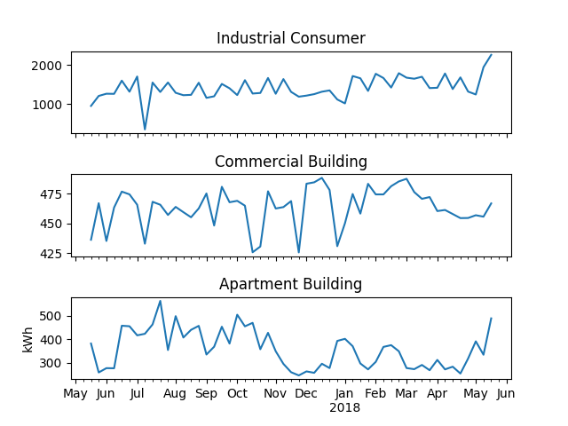
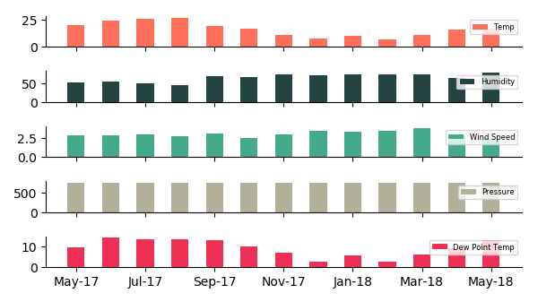
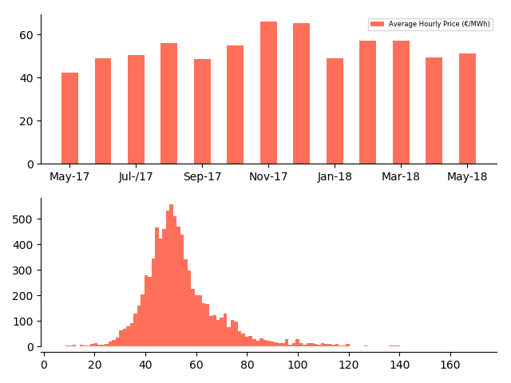

[Introduction](./index.html) | [Correlation Analysis](./pages/corr_analysis.html) | [Forecasting](./pages/forecasting.html) | [Conclusion](./pages/conclusion.html)

Electricity is a major contributor towards the cost of running facilities either in a commercial setting or a household setup. In this project we model electricity demand for three different categories of real estate projects - An Industrial Consumer, a Commercial Building and a Commercial Real Estate (apartment block).

The objective is to use currently available electricity demand/usage data and weather data to analyze, model and forecast electricity demand across the three categories of electricity customers.

Electricity prices are additionally observed to be volatile and therefore tend to induce significant cashflow and earnings management challenges in an industrial or commercial setting where electricity consumption is significant. Electricity demand forecasting can therefore provide significant cost saving benefits as projected demand can be used to purchase electricity from energy markets in forward looking markets thus providing cash flow flactuation and earnings management.

Electricity is arguably considered a commodity due to the funngible characteristic in addition to the fact that it is not stored once it is produced. These characteristics imply that electrcity trading markets remove significant market inneficiencies that arise as a result of over production and undersupply of electricity.

### Data Description

In this study we make use of three general kinds of datasets -electricity demand/usage data, weather data and energy price data which tells the daily price for electricity at the selected location. The data spans one year (18/05/2017 - 18/05/2018)  and recorded on hourly observations leading to about 8760 observations. The general working hypothesis is that weather affects the amount of energy consumed in various settings, the extent to which weather may impact consumption may however differ.

#### Consumption data

Consumption data contains usage data for one year for three different premises, industrial building, commercial building and commercial real estate. Each of the locations have one meter so one number for the amount of electricity usage. The electricity consumption is in [Kilowatt hour](https://en.wikipedia.org/wiki/Kilowatt_hour).

| Elec Consumption Variables (KWh)| mean   | min   | max    | std   | skewness | kurtosis |
|:------------------------|:-------|:------|:-------|:------|:---------|:---------|
| Industry consumer (ic)  | 1417,5 | 0,0   | 3777,8 | 1219,9|  0,4	   | -1,5     |
| Commercial building (bc)| 464,4	 | 232,5 | 787,2	| 163,1 |  0,5	   | -1,2     |
| Apartment Building (rc) | 358,6	 | 14,1	 | 1421,7	| 276,0	|  1,2	   |  0,8     |

Monthly overview of the electricity consumption data set.

#### Weather data

Weather data has five attributes/features temperature (T), pressure (P), humidity (U), wind speed (Ff) and dew point (Td). Notable from the weather statistics, the temperature is positively skewed while the dewpoint is neagtively skewed. Our model is limited for these variables but more variables could added for further testing.

| Weather Variables (Hourly)| mean   | min   | max    | std   | skewness | kurtosis | info              |
|:------------------------|:-------|:------|:-------|:------|:---------|:---------|:------------------|
| Temp (T)                | 16,5	 | -6,0	 | 39,5	  | 7,8   |	0,2      | -0,5     |[T](https://en.wikipedia.org/wiki/Temperature) |
| Pressure (P)            | 760,9	 | 742,4 | 776,6  | 5,2	  | -0,3	   |  0,8     |[P](https://en.wikipedia.org/wiki/Pressure) |
| Humidity (U)            | 65,8	 | 13,5	 | 100,0  | 18,6  | -0,4	   | -0,7     |[U](https://en.wikipedia.org/wiki/Humidity) |
| Wind Speed (Ff)         | 3,0	   | 0,5   | 13,0	  | 1,6	  | 1,5      |	3,2     |[Ff](https://en.wikipedia.org/wiki/Wind_speed) |
| Dewpoint Temp (Td)      | 9,2	   | -11,5 | 23,5	  | 5,5	  | -0,5	   |  0,4     |[Td](https://en.wikipedia.org/wiki/Dew_point)|

#### Price data

The price data contains hourly price for the electricity as recorded in the electricity exchange. This data is used to estimate the associated electricity cost (multiplying daily usage with the price) across the consumers.

| Hourly Price (€/Mwh) | mean | min  | max    | std   | skewness | kurtosis |
|:---------------------|:-----|:-----|:-------|:------|:---------|:---------|
|      -               | 54,0 | 7,0  | 170,0  | 15,5  |  1,7     |5,6       |

The graph below shows the average hourly price (€/MWh) in the sample period indicating increasing energy prices during Winter periods. The hourly price histogram also indicates that the prices are positively skewed and hence the depict the risk that a consumer would be mitigating by managing the volatility in electricity prices.

