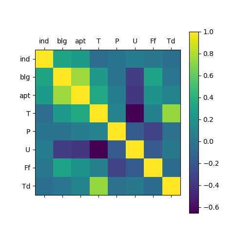
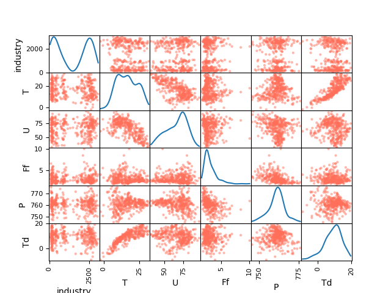
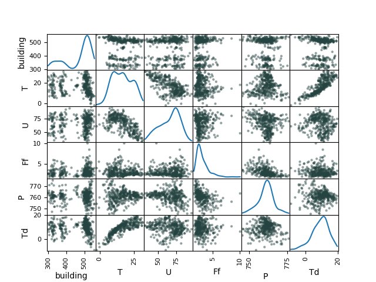
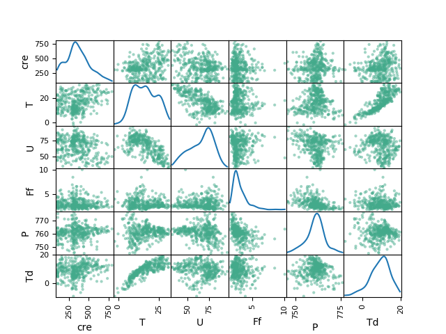
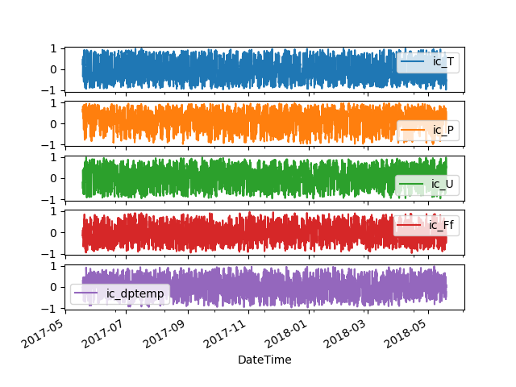

[Introduction](./../index.html) | [Correlation Analysis](./../pages/corr_analysis.html) | [Forecasting](./../pages/forecasting.html) |[Conclusion](./../pages/conclusion.html)

## Correlation Analysis
In this section we model the correlations in the data primarily investigating the relationship between various weather parameters with energy consumption of different sample consumer segments.

### "Static" correlations
Correlation map below indicates how different weather parameters are correlated to energy consumption across the three customer segments including how the weather parameters correlate. When the correlation is negative (temperature for example) it means that when temperature goes down the electricity consumption increases.

The energy consumer segments have positive correlations although low while temperature has a positive correlation with enery consumption in a commercial building and an apartment block while the correlation is negative for an industrial consumer.

##### Industrial energy consumption and weather parameters

##### Commercial building energy consumption and weather parameters

##### Residential block energy consumption and weather parameters

#### Rolling correlations

Rolling correlations for of different weather attributes and energy consumption for the industrial customer (ic) indicating that the correlations are not stable through out the sample period

[back](./../pages/corr_analysis.html)
