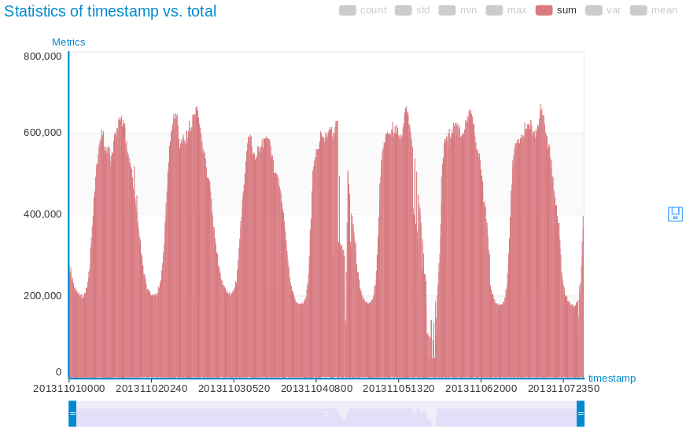
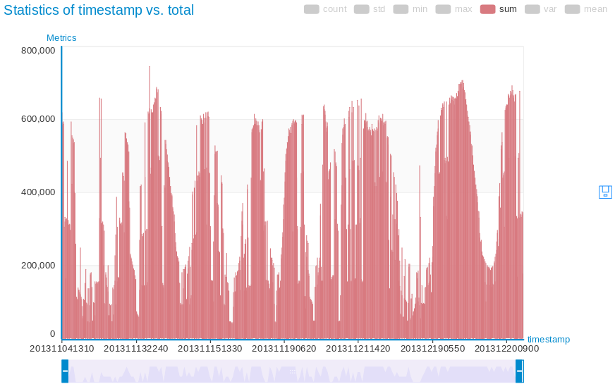
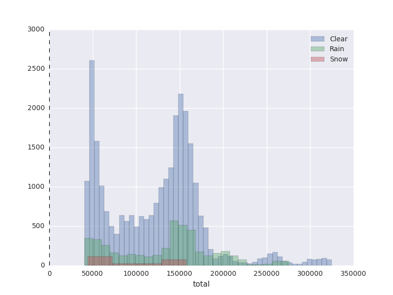

[Introduction](./../index.html) | [Milano Data Analysis](./../pages/milano.html) | [Trento Data Analysis](./../pages/trento.html) | [Weather Correlation](./../pages/correlation.html)

On the official site,  it states that the weather data has a feature named ‘Type’ with three different values 0,1, and 2 whereas 0 indicates clear weather, 1 shows rain, and 2 represents snow. So I read that data and filtered it out for three different frames as per their types. Then I joined this data with telecommunication usage data based on time column. I used that data to
plot the frames individually and together as distribution plots. 

#### Telecommunication activities comparison with weather conditions

The following are the results of overall telecommunication (sms, calls, and internet) during different weather conditions.  The first first two results are for clear weather and rainy weather. The results indicate that for the clear weather overall usage of calls, sms, internet activity is higher than rain days. 

##### Clear Weather and Total Telecommunication

##### Rain Weather and Total Telecommunication

Similarly, the data suggests that the telecommunication usage for rainy days is higher than the days when it is snowing.

##### Snow Weather and Total Telecommunication

To get a more detail understanding, following graph explicits the above described detail in more significant way.

[back](./trento.html)                                                                          
