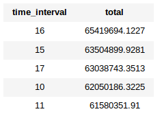
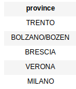
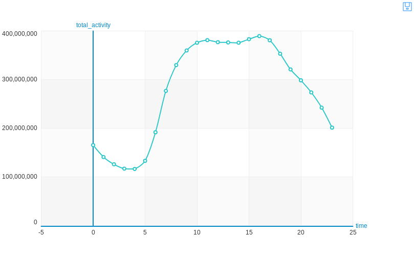
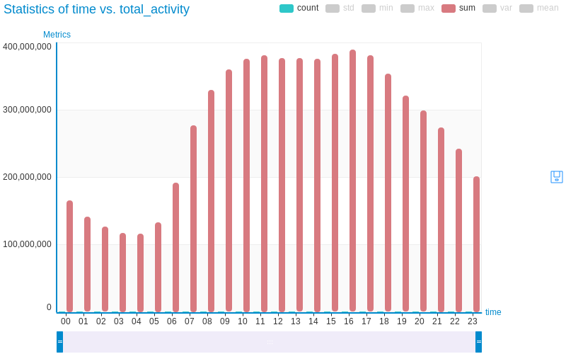
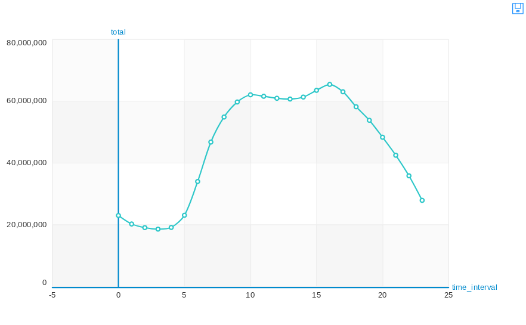
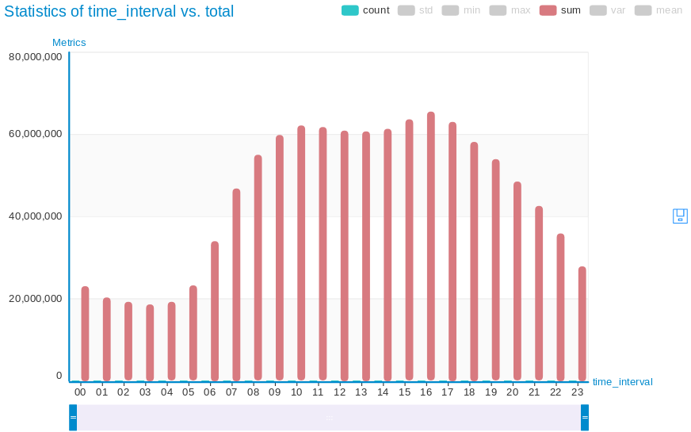

[Introduction](./../index.html) | [Milano Data Analysis](./../pages/milano.html) | [Trento Data Analysis](./../pages/trento.html) | [Weather Correlation](./../pages/correlation.html)

Following the techniques used for Milano dataset, in Trento data analysis the telecommunication data was merged before applying the analysis techniques. Data was given with an interval of 10 minutes for sms in and out, calls in and out, and internet activity.

#### Trento Congested Hours

I merged all this data on the basis of timestamp. Then the data was grouped together for the same hours. The same approach has been applied for the data of each day for November and December. In the end, the hours with maximum telecommunication congestion were filtered out. Following are the most busy hours in Trento along the total telecommunication activity over
the period of November and December.

#### Most Called Province From Trento

All the csv files from the directory are read through GraphLab as one single frame. The GraphLab makes it easy to read hundreds and thousands of files in parallel and returns them as a single frame. The returned frame was then processed to find out the provinces where people of Milan called the most.

#### Telecommunication activities in November and December 2013

The Trento data was given in two parts Nov and Dec. The purpose of this study was to analyse and compare the telecommunication activities of users with the Milano. Following are the graphs of total telecommunication activity for Trento. It was interesting to see that the total telecommunication activity of Trento is significantly lower than Milano. If we look at the resutls, it is clear that the total telecommunication in Trento never came closer to the total activity of Milano. The highest telecommunication activity in
Trento was recorded a bit higher than 6e7, whereas in Milano the highest activity recorded was almost 4e8.

#### Telecommunication activities comparison of day and night usage

With the data of Trento, to analyse the communication pattern of users during day and night, the following line chart gives a clear sight. If we look at this line chart it shows that the maximum activity was recorded around 16. Overall the telecommunication activity was in an increasing order during the day time. After 16 its in a continuous decrease but overall the communication pattern suggests that the users were more active during the day time (8AM-8PM) as compare to the night.

The following bar chart shows the same results.

[back](./../index.html)                                                                            [next](./correlation.html)
